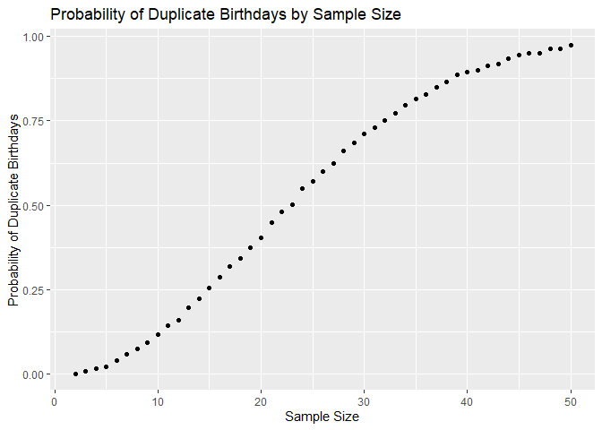
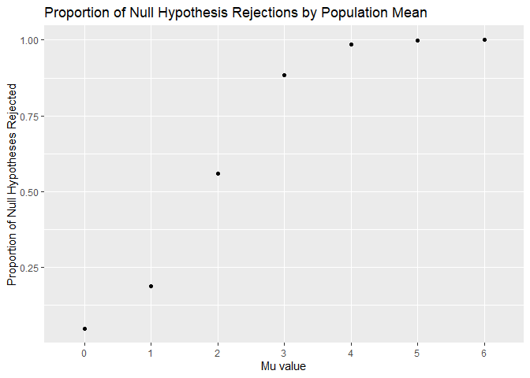
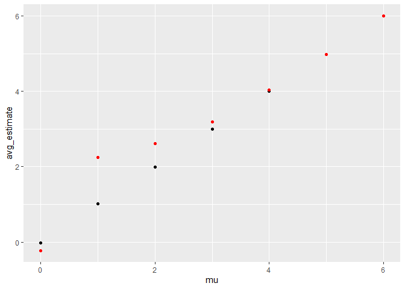
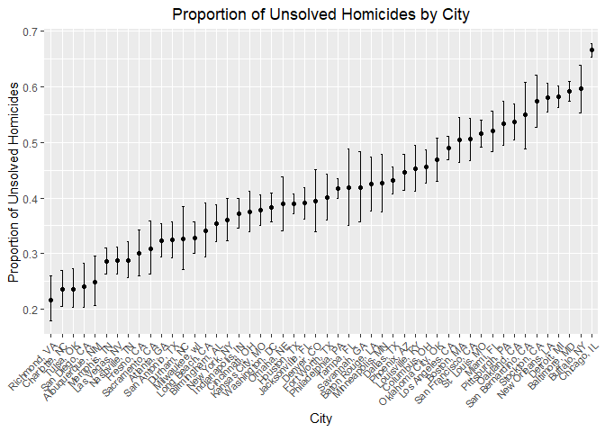

p8105_hw5_jl7035
================
Jeffrey Lin
2024-11-11

# Load Libraries

``` r
library(tidyverse)
```

    ## ── Attaching core tidyverse packages ──────────────────────── tidyverse 2.0.0 ──
    ## ✔ dplyr     1.1.4     ✔ readr     2.1.5
    ## ✔ forcats   1.0.0     ✔ stringr   1.5.1
    ## ✔ ggplot2   3.5.1     ✔ tibble    3.2.1
    ## ✔ lubridate 1.9.3     ✔ tidyr     1.3.1
    ## ✔ purrr     1.0.2     
    ## ── Conflicts ────────────────────────────────────────── tidyverse_conflicts() ──
    ## ✖ dplyr::filter() masks stats::filter()
    ## ✖ dplyr::lag()    masks stats::lag()
    ## ℹ Use the conflicted package (<http://conflicted.r-lib.org/>) to force all conflicts to become errors

# Problem 1

## Functions for Randomly Drawing Birthdays and calculating prob of duplicates

``` r
dup_bdays = function(samp_size) {
  bday_vec <- sample(c(1:365), size = samp_size, replace = TRUE)

  if (n_distinct(bday_vec) < samp_size) {
    return(TRUE)
  } else {
    return(FALSE)
  } 
}
```

## Run Simulations from sample size 2 to 50

``` r
prob_by_size <- c()

for (sample_size in 2:50){
  num_dups = 0
  for (iteration in 1:10000) {
    if (dup_bdays(sample_size))
      num_dups = num_dups + 1
  }
  
  avg_prob = num_dups / 10000
  prob_by_size = append(prob_by_size, values = avg_prob)
}

dup_bday_tbl <-
  tibble(
    sample_size = 2:50,
    avg_prob = prob_by_size
  )
```

## Plot of probability of duplicate birthdays by sample size

``` r
dup_bday_tbl %>% 
  ggplot(aes(x = sample_size, y = avg_prob)) +
  geom_point() +
  xlab("Sample Size") +
  ylab("Probability of Duplicate Birthdays") +
  ggtitle("Probability of Duplicate Birthdays by Sample Size")
```

<!-- --> As
the sample size increases, the probability of duplicate birthdays
increases. The probability of having duplicate birthdays grows above
0.50 around a sample size of 23.

# Problem 2

## Generate 5000 datasets for mu = 0 and save p-values

``` r
n <- 30
sigma <- 5
pop_param <- 0

x_bar_vec <- c()
p_val_vec <- c()

for (iter in 1:5000) {
  rand_samp <- rnorm(n, pop_param, sigma)
  x_bar <- mean(rand_samp)
  x_bar_vec = c(x_bar_vec, values = x_bar)
  
  p_val <- 
    t.test(rand_samp, mu = 0, conf.level = 0.95) %>%
    broom::tidy() %>% 
    pull(p.value)
    
  p_val_vec = c(p_val_vec, p_val)
  
}

t_test_results <- tibble(
  samp_avg = x_bar_vec,
  p_val = p_val_vec
)
```

# Write Function that handles generating datasets and finding p-values for mu

``` r
gen_test_data <- function(pop_param_vec, n, sigma, results) {
  x_bar_vec <- numeric()
  p_val_vec <- numeric()
  for (val in pop_param_vec) {
    for (iter in 1:5000) {
      rand_samp <- rnorm(n, val, sigma)
      x_bar <- mean(rand_samp)
      x_bar_vec <- c(x_bar_vec, x_bar)
      
      p_val <- 
      t.test(rand_samp, mu = 0, conf.level = 0.95) %>%
      broom::tidy() %>% 
      pull(p.value)
      p_val_vec <- c(p_val_vec, p_val)
      
    }
  }
  results <- 
    bind_rows(results, tibble(samp_avg = x_bar_vec, p_val = p_val_vec))
  return(results)
}
```

## Generate datasets and perform t-tests for mu values 1 to 5

``` r
mu_vec <- c(1, 2, 3, 4, 5, 6)
t_test_results <- gen_test_data(mu_vec, n, sigma, t_test_results)

t_test_results <- t_test_results %>% 
  mutate(
    mu = ((row_number() -1) %/% 5000)
  )
```

## Proportion of Times Null was rejected in relation to true mean

``` r
t_test_results %>% 
  group_by(mu) %>% 
  summarize(Prop_Reject = sum(p_val <  0.05) /5000) %>% 
  ggplot(aes(x = factor(mu), y = Prop_Reject)) +
  geom_point() +
  xlab("Mu value") +
  ylab("Proportion of Null Hypotheses Rejected") +
  ggtitle("Proportion of Null Hypothesis Rejections by Population Mean")
```

<!-- -->
Since we are conducting a t-test, where the supposed population mean is
0, we can see that as the actual value of mu increases, the proportion
of null hypotheses rejected also increases. This suggests that as effect
size increases, power increases.

## Plot Average Sample Mean vs True Population Mean

``` r
null_rejected <- t_test_results %>% 
  filter(p_val < 0.05) %>% 
  group_by(mu) %>% 
  summarize(avg_estimate = mean(samp_avg))

t_test_results %>% 
  group_by(mu) %>% 
  summarize(avg_estimate = mean(samp_avg)) %>% 
  ggplot(aes(x = mu, y = avg_estimate)) +
  geom_point() +
  geom_point(data = null_rejected, color = "red")
```

<!-- -->
Looking at the average estimate of the mean in null hypothesis rejected
cases only, we see that estimates are not similar to the true means for
mu = 1 and 2, but become increasingly good approximations of the true
mean as mu approaches 6. This is likely the case, as the increasing
effect size will increase likelihood of rejecting the null hypothesis.
For example, since our t-tests are being conducted with mu = 0, for the
null hypothesis to be rejected when the true mean is 1 or 2 and the
standard deviation being rather large, we would need more extreme sample
mean estimates.

# Problem 3

## Load in the Data

``` r
url <- 
  "https://raw.githubusercontent.com/washingtonpost/data-homicides/master/homicide-data.csv"
homocide_df <- read_csv(url)
```

    ## Rows: 52179 Columns: 12
    ## ── Column specification ────────────────────────────────────────────────────────
    ## Delimiter: ","
    ## chr (9): uid, victim_last, victim_first, victim_race, victim_age, victim_sex...
    ## dbl (3): reported_date, lat, lon
    ## 
    ## ℹ Use `spec()` to retrieve the full column specification for this data.
    ## ℹ Specify the column types or set `show_col_types = FALSE` to quiet this message.

## Examine Raw Data

``` r
head(homocide_df)
```

    ## # A tibble: 6 × 12
    ##   uid   reported_date victim_last victim_first victim_race victim_age victim_sex
    ##   <chr>         <dbl> <chr>       <chr>        <chr>       <chr>      <chr>     
    ## 1 Alb-…      20100504 GARCIA      JUAN         Hispanic    78         Male      
    ## 2 Alb-…      20100216 MONTOYA     CAMERON      Hispanic    17         Male      
    ## 3 Alb-…      20100601 SATTERFIELD VIVIANA      White       15         Female    
    ## 4 Alb-…      20100101 MENDIOLA    CARLOS       Hispanic    32         Male      
    ## 5 Alb-…      20100102 MULA        VIVIAN       White       72         Female    
    ## 6 Alb-…      20100126 BOOK        GERALDINE    White       91         Female    
    ## # ℹ 5 more variables: city <chr>, state <chr>, lat <dbl>, lon <dbl>,
    ## #   disposition <chr>

The homocide statistics df includes 12 columns and 52179 observations.
The important variables included in this dataset are the first and last
names of the victim, the sex of the victim, the date of which the crime
occurred, the location (city, state, lat, lon), and the outcome of the
investigation.

## Summarize number of homocides and unsolved homocides by city

``` r
homocide_df <- homocide_df %>% 
  mutate(
    state = 
      case_when(
      state == "AL" & city == "Tulsa" ~ "OK",
      .default = state
    ), 
    city_state = str_c(city, ", ", state)
  ) 

total_and_unsolved <- homocide_df %>% 
  group_by(city_state) %>% 
  summarize(
    total = n(),
    unsolved = sum(disposition %in% 
      c("Closed witihout arrest", "Open/No arrest"))
  )
```

## Proportion of Unsolved Homocides in Baltimore

``` r
bal_stats <- total_and_unsolved %>% 
  filter(city_state == "Baltimore, MD")

bal_prop_test <- 
  prop.test(pull(bal_stats, unsolved), pull(bal_stats, total))

bal_prop_test %>% 
  broom::tidy() %>% 
  select(estimate, conf.low, conf.high)
```

    ## # A tibble: 1 × 3
    ##   estimate conf.low conf.high
    ##      <dbl>    <dbl>     <dbl>
    ## 1    0.592    0.573     0.610

## Function for Calculating Prop Estimate

``` r
estimate_prop = function(unsolved, total) {
  prop_est <- prop.test(unsolved, total) %>% 
  broom::tidy() %>% 
  select(estimate, conf.low, conf.high)
  
  return(prop_est)
  
}
```

## Calculate prop of unsolved homocides for all cities

``` r
total_and_unsolved <- total_and_unsolved %>% 
  mutate(
    prop_estimate = map2(
      pull(total_and_unsolved, unsolved),
      pull(total_and_unsolved, total),
      \(x, y) estimate_prop(unsolved = x,total = y))
  )
```

## Plot proportion of unsolved homocides by city

``` r
total_and_unsolved %>% 
  unnest(prop_estimate) %>%
  ggplot(aes(x = fct_reorder(city_state, estimate), y = estimate)) +
  geom_point() +
  xlab("City") +
  ylab("Proportion of Unsolved Homicides") +
  ggtitle("Proportion of Unsolved Homicides by City") +
  geom_errorbar(aes(ymin = conf.low, ymax = conf.high), width = 0.2) +
  theme(
    plot.title = element_text(hjust = 0.5),
    axis.text.x = element_text(angle = 45, vjust = 1, hjust = 1, size = 8)
  )
```

<!-- -->
